# 代码管理及集成(Git)

---

# Git 基础

基本操作

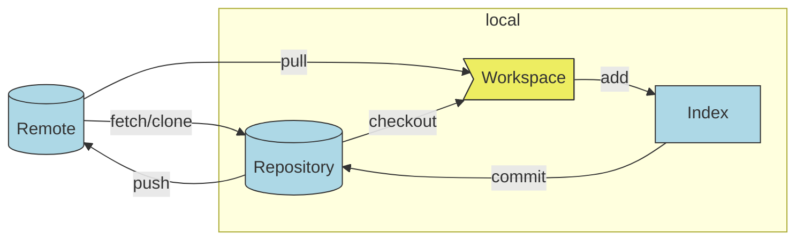

---

# 常用操作

- 分支合并
- 撤销变更
- 修改任意提交
- 暂存操作
- 提交信息说明
- 分支管理
- PR 操作

---
layout: center
class: text-center
---

# 分支合并

初始状态

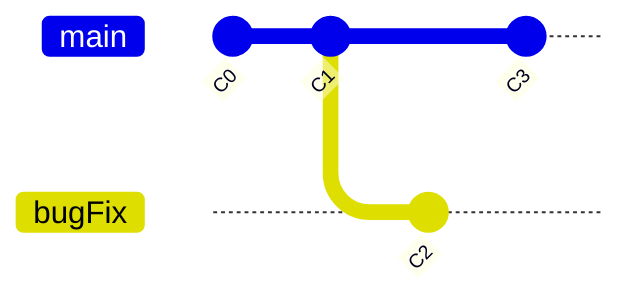

---
layout: two-cols
name: 分支合并操作比较
---

# git merge

将**指定分支**合并到**当前**分支

<v-click>

```bash
git checkout main
git merge bugFix
```

</v-click>

<v-click>

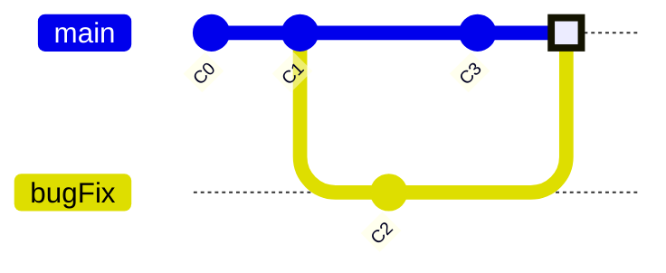

</v-click>

::right::

# git rebase

将**当前分支**添加到**指定分支**的最前面

<div v-click class="inline-flex mb-2">
  <ph-shield-warning class="text-2xl text-yellow-300 animate-ping mx-2"/> 

> 只对尚未推送或分享给别人的本地修改执行**rebase**清理历史， 从不对已推送至别处的提交执行**rebase**

</div>

<v-click>

```bash
# 第一步
git checkout bugFix
git rebase main
# 第二步
git checkout main
git merge bugFix
```

</v-click>

<v-click>

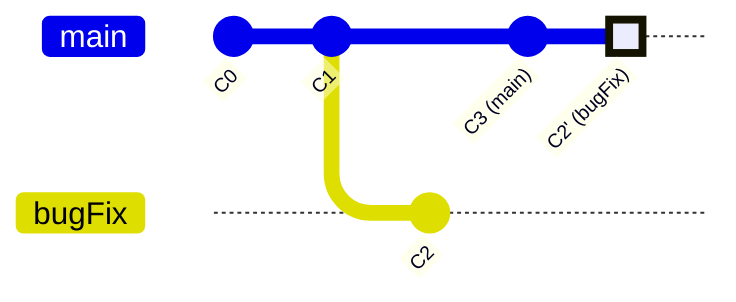

</v-click>

---
layout: center
class: text-center
---

# 撤销变更

初始状态

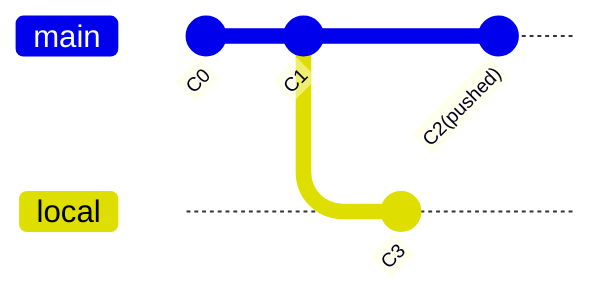

---
layout: two-cols
name: 撤销变更（一）
---

# git reset

变更本地,只是修改了历史提交记录

```bash
git switch local # 切换到local分支
git reset HEAD^ # 回滚至上一次提交，本次修改保存在工作区
```

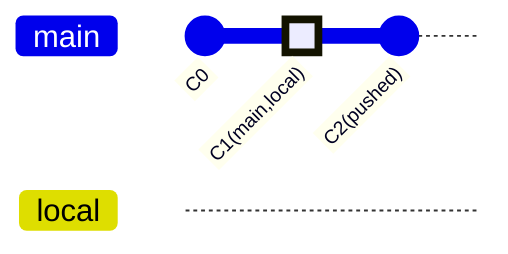

[前进和后退](https://github.blog/2015-06-08-how-to-undo-almost-anything-with-git/#redo-after-undo-local)

```
git reflog  # 查看操作记录
git reset HEAD@{num} # 回到指定的位置

# 操作记录信息
707153e (HEAD -> main, ...) HEAD@{0}: C1
8db3b3b HEAD@{1}: C0
```

::right::

# git revert

变更远程，生成新的提交记录，不改变提交历史记录

```bash
git switch main # 切换到main分支
git pull # 同步远程
git revert HEAD # 撤销上一次提交，并生成新的提交
```

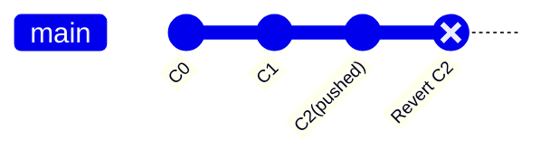

---
name: 撤销变更（二）
---

# 撤销变更详细说明

| 命令   | 特点   | 建议   |
| :----- | :---- | :---- |
| git checkout \-\- 文件  | 回滚本地工作区未暂存的改动，<br>被丢弃的内容不可恢复 | 操作前务必确认要回滚的改动时不再需要的 |
| git reset HEAD 文件   | 滚动暂存区的文件改动 | 一般不加 --hard 选项 |
| git reset \<commit\> <br> git reset HEAD^ <br> git reset HEAD~num  | 回滚到目标commit，<br> 丢弃该 commit 之后的提交记录，<br> 将被丢弃记录所做的改动保留在工作区 | 1. 只操作本地记录，禁止操作已push的记录 <br> 2. 慎用 --hard 选项 |
| git reset HEAD@{num} | 回到某个操作时刻，num可以通过操作记录查看，<br>即`git reflog`结果 |  1. 只操作本地记录，禁止操作已push的记录 <br> 2. 慎用 --hard 选项 |
| git commit --amend   | 修改最后一次commit的内容和提交日志 | 只操作本地记录，禁止操作已push的记录 |
| git revert \<commit\>  | 回滚相关commit所做的改动，<br> 再次提交将生成新的commit，<br>历史提交记录不受影响 | 已push的内容如果要回滚只能使用revert |

---
layout: center
class: text-center
---

# 修改任意提交

git cherry-pick / git rebase -i

---
layout: two-cols
name: 修改任意提交 git cherry-pick
---

# 修改任意提交

git cherry-pick 它常用于将部分变动（某几个commit）应用到指定分支上

```bash
# 将指定的提交应用到当前分支
git cherry-pick <commitHash> [<commitHash> ...]

# 将commitA到commitB的所有提交应用到当前分支
git cherry-pick commitA..commitB

# 将commitA到commitB的所有提交应用到当前分支,但不包含commitA
git cherry-pick commitA^..commitB

# 将指定分支的最近一次提交应用到当前分支
git cherry-pick <branch-name>
```

::right::

#### 案例-将某次提交应用到main分支

初始状态

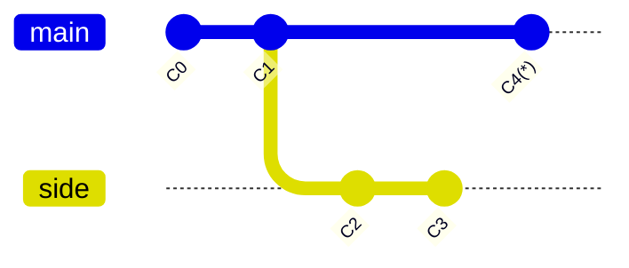

在`main`分支执行 `git cherry-pick C2`，则：

<v-click>

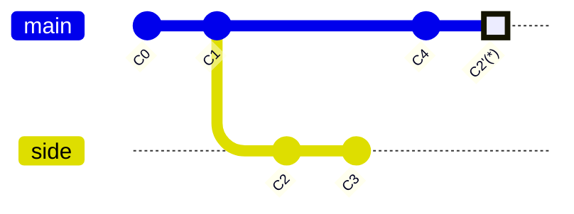

</v-click>

---
layout: two-cols
name: 修改任意提交 git rebase -i
---

# 修改任意提交

git rebase -i （-i表示在命令行以交互式的方式操作），它一般用于将提交记录整理成***线性***，
避免***蛇形***分支图，常用于对交记录进行修改，合并，重新排序等操作

常用的commit修改指令说明

```
p, pick   保留该commit 
r, reword 保留该commit，并修改该提交信息 
e, edit   保留该commit，并允许修改该commit 
s, squash 将该commit和前一个commit合并 
f, fixup  将该commit和前一个commit合并,但不保留该提交信息 
d, drop   丢弃该commit
```

::right::

#### 案例-合并最后2次提交并修改提交信息
初始状态

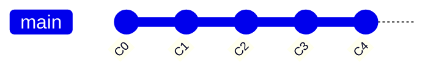

执行 `git rebase -i HEAD~2`，显示互动界面：

<v-click>

```
r e9ca05d C3
f 8ed7e08 C4

# Rebase 2173218..8ed7e08 onto 2173218 (2 commands)
#
# Commands:
# p, pick <commit> = use commit
# ...
```

</v-click>

<v-click>

最终效果：

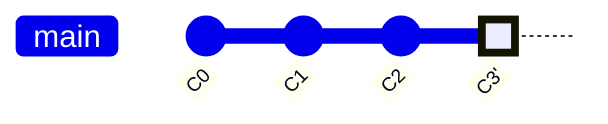
</v-click>

---

# 暂存操作

git stash

```bash
git stash [message] #保存
git stash list #查看保存记录
git stash pop [stash@{num}] #恢复一次
git stash apply [stash@{num}] #恢复多次
git stash drop [stash@{num}] #删除指定的保存记录
git stash clear #删除所有的记录
```

---
layout: center
---

# Commit message

提交信息指南

```
<type>(<scope>): <subject>
<BLANK LINE>
<body>
<BLANK LINE>
<footer>
```

---
layout: two-cols
name: commit message desc
---

# Commit message 

格式说明

| 字段    | 描述 |
| ------  | --- |
| Scope   |修改的影响范围（可选）|
| Subject | commit的简洁描述，以动词开头，<br>第一个子母小写，结尾不加(.) |
| Body    |应该说明代码变动的动机，以及与以前行为的对比 |
| Footer  |主要说明 Breaking Changes和相关的issue |
| Revert  |当前 commit 用于撤销以前的 commit，则必须以`revert:`开头，后面跟着被撤销 Commit 的 Header,Body写成This reverts commit \<hash\> |

::right::

type 说明

| type     | 描述   |  
| -----    | ----- |
| feat     |添加新功能 |
| fix      | 修复bug |
| docs     |文档修改 |
| style    |不影响代码运行的修改，包括空白符处理，格式化等 |
| refactor |重构（既不是添加新功能，也不是代码的修改）|
| perf     |改善性能的改变 |
| test     |添加或者修改测试 |
| chore    |辅助工具的修改，包括构建工具，CI等 |

---

# Commit message

[案例](https://github.com/angular/angular)

```
fix(animations): Ensure elements are removed from the cache after leave animation. (#50929)
perf(platform-browser): do not remove renderer from cache when `REMOVE_STYLES_ON_COMPONENT_DESTROY` is enabled.
feat(common): Allow ngSrc to be changed post-init (#50683)
test(core): update runtime error list to include deps tracker error (#50980)
build: update dependency lighthouse-logger to v2 (#51075) 
refactor(compiler): introduce deferred block AST (#51050) 
docs: add privacy policy link at the bottom of the page (#51013) 
ci: migrate devtools tests to GHA (#51008) 
Revert "fix(zone.js): enable monkey patching of the `queueMicrotask()` API in node.js (#50467)" (#50529)
```

详细信息

```
fix(animations): Ensure elements are removed from the cache after leave animation. (#50929)

This commit fixes a memory leak.

`_namespaceLookup` was cleared before the call to `processLeaveNode()` which was using the lookup.
Without that lookup `clearElementCache()` wasn't called thus keeping a reference to the element.

Fixes #24197 & #50533

PR Close #50929
```

---

# Commit message 

[工具(commitizen)](http://commitizen.github.io/cz-cli/)

```
$ git-cz
cz-cli@4.3.0, cz-conventional-changelog@3.3.0

? Select the type of change that you're committing: (Use arrow keys)
❯ feat:     A new feature 
  fix:      A bug fix 
  docs:     Documentation only changes 
  style:    Changes that do not affect the meaning of the code (white-space, formatting, missing semi-colons, etc) 
  refactor: A code change that neither fixes a bug nor adds a feature 
  perf:     A code change that improves performance 
  test:     Adding missing tests or correcting existing tests
  refactor: A code change that neither fixes a bug nor adds a feature 
  perf:     A code change that improves performance 
  test:     Adding missing tests or correcting existing tests 
  build:    Changes that affect the build system or external dependencies (example scopes: gulp, broccoli, npm) 
  ci:       Changes to our CI configuration files and scripts (example scopes: Travis, Circle, SauceLabs) 
  chore:    Other changes that don't modify src or test files 
  revert:   Reverts a previous commit 
(Move up and down to reveal more choices)
```

--- 

# Commit message 

[工具 (commitlint)](https://commitlint.js.org/#/)

```
$ git commit -m "change commit message position"  
⧗   input: change commit message position
✖   subject may not be empty [subject-empty]
✖   type may not be empty [type-empty]

✖   found 2 problems, 0 warnings
ⓘ   Get help: https://github.com/conventional-changelog/commitlint/#what-is-commitlint

husky - commit-msg hook exited with code 1 (error)
```

---

# [Git hooks](https://githooks.com/) 配置 (基于 [husky](https://typicode.github.io/husky))

- 提交前触发 `pre-commit`
```bash
. "$(dirname "$0")/_/husky.sh"

npm test
```

- 在启动提交信息编辑器运行 `prepare-commit-msg`
```bash
. "$(dirname "$0")/_/husky.sh"

exec < /dev/tty && yarn commit --hook || true
```

- 验证提交信息 `commit-msg`
```bash
. "$(dirname "$0")/_/husky.sh"

npx --no-install commitlint --edit "$1"
```

---

# 生成 CHANGELOG

- [conventional-changelog-cli](https://github.com/conventional-changelog/conventional-changelog/tree/master/packages/conventional-changelog-cli)
- [standard-version](https://github.com/conventional-changelog/standard-version)


---
name: 分支管理（一）
---

# Git Flow

分支管理

<div class="w-150 m-auto"></div>

---
name: 分支管理（二）
---

# Git Flow

分支管理

<div class="w-72 m-auto"></div>

---
name: 分支管理（三）
---

# Git Flow

分支管理

<div class="w-150 m-auto"></div>

---

# Lock Branch

当远程分支设置为保护分支时，而此时你已经直接提交到保护分支了


<v-click>

### 正确操作

```bash
# reset 和远程分支保持一致
git reset --hard HEAD^
# 基于上一次提交创建临时分支
git checkout -b <branch_name> <hash> 
# 将临时分支推送到远程，然后发起pr
git push origin <branch_name>
```

</v-click>

---

# Pull Request

> Pull requests let you tell others about changes you've pushed to a branch in a repository on GitHub. Once a pull request is opened, you can discuss and review the potential changes with collaborators and add follow-up commits before your changes are merged into the base branch.

无论采用哪种Git Flow，最佳的做法是仓库管理员已经将**master分支**设置为**保护分支**，开发人员应创建临时分支，完成后向**master分支**发起 pull request，
代码通过CI(检查代码是否符合编写规范，commit message是否遵守约定等等)和代码评审后合并进主分支（同时删除临时分支）。

### 大致的流程


---

# 代码评审

创建pull request后，添加评审员，并及时通知，评审者主要审核基本信息是否完整，对代码逐行查看，
并及时沟通。


---

# Github CI (Actions)

<div class="h-420px overflow-y-auto">

```yaml
name: build iron ui website
on:
  push:
    branches:
      - master
jobs:
  build:
    name: build app
    runs-on: ubuntu-latest
    steps:
      - name: Checkout
        uses: actions/checkout@v2
        with:
          persist-credentials: false
      - name: Build
        env:
          PUBLIC_URL: /iron-ui
        run: |
          yarn
          yarn build-storybook          
      - name: Build and Deploy
        uses: JamesIves/github-pages-deploy-action@releases/v3
        with:
          ACCESS_TOKEN: ${{ secrets.ACCESS_TOKEN }}
          BRANCH: gh-pages # The branch the action should deploy to.
          FOLDER: storybook-static # The folder the action should deploy.

```

</div>

---

# 参考信息

- [conventional commit](https://www.conventionalcommits.org/en/v1.0.0/)
- [git learning](https://learngitbranching.js.org/)
- [git doc](https://git-scm.com/doc)
- [GitHub Actions](https://docs.github.com/en/actions)