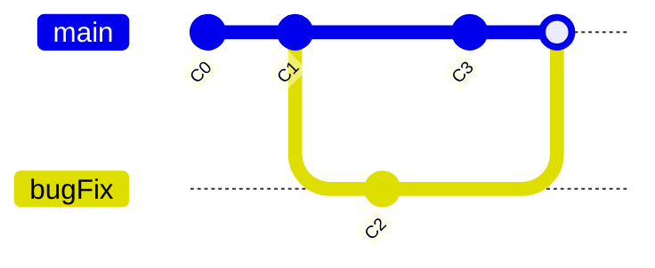
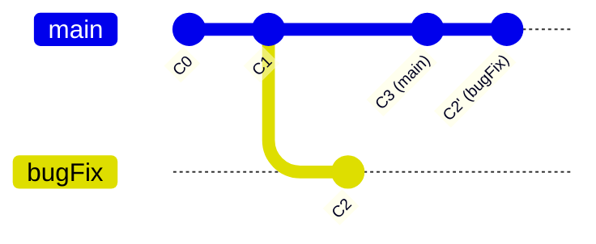
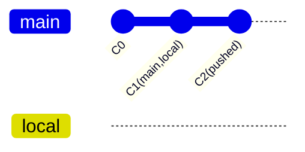
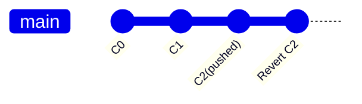

---
# try also 'default' to start simple
theme: seriph
title: 代码管理及集成 (基本Git)
# random image from a curated Unsplash collection by Anthony
# like theme? see https://unsplash.com/collections/94734566/slidev
background: https://source.unsplash.com/collection/94734566/1920x1080
# apply any windi css classes to the current slide
class: "text-center"
# https://sli.dev/custom/highlighters.html
highlighter: shiki
drawings: 
  enabled: dev
# some information about the slides, markdown enabled
info: |
  ## 代码管理及集成(Git)
---

# 代码管理及集成(Git)

---

# Git 基础

基本操作


---

# 常用操作

- 分支合并
- 撤销变更
- 暂存操作
- PR 操作
- 分支管理

---
layout: center
class: text-center
---

# 分支合并

初始状态


---
layout: two-cols
name: 分支合并操作比较
---

# git merge

git merge: 将**指定分支**合并到**当前**分支

<v-click>

```bash
git checkout main
git merge bugFix
```

</v-click>

<v-click>



</v-click>

::right::

# git rebase

将**当前分支**添加到**指定分支**的最前面

<v-click>

```bash
# 第一步
git checkout bugFix
git rebase main
# 第二步
git checkout main
git merge bugFix
```

</v-click>

<v-click class="mt-10">



</v-click>

<div v-click class="inline-flex">
  <ph-shield-warning class="text-2xl text-yellow-300 animate-ping mx-2"/> 

> 只对尚未推送或分享给别人的本地修改执行**rebase**清理历史， 从不对已推送至别处的提交执行**rebase**

</div>

---
layout: center
class: text-center
---

# 撤销变更

初始状态


---
layout: two-cols
name: 撤销变更（一）
---

# git reset

```bash
git reset HEAD^ # 变更本地,只是修改了历史提交记录
```



::right::

# git revert

```bash
git revert HEAD # 变更远程
```



---
name: 撤销变更（二）
---

# 撤销变更详细说明

| 命令   | 特点   | 建议   |
| :----- | :---- | :---- |
| git checkout -- 文件  | 回滚本地工作区未暂存的改动，<br>被丢弃的内容不可恢复 | 操作前务必确认要回滚的改动时不再需要的 |
| git reset HEAD 文件   | 滚动暂存区的文件改动 | 一般不加 --hard 选项 |
| git reset [commit]   | 回滚到目标commit，<br> 丢弃该 commit 之后的提交记录，<br> 将被丢弃记录所做的改动保留在工作区 | 1. 只操作本地记录，禁止操作已push的记录 <br> 2. 慎用 --hard 选项 |
| git commit --amend   | 修改最后一次commit的内容和提交日志 | 只操作本地记录，禁止操作已push的记录 |
| git revert [commit]  | 回滚相关commit所做的改动，<br> 再次提交将生成新的commit，<br>历史提交记录不受影响 | 已push的内容如果要回滚只能使用revert |
---

# 任意修改提交记录

<div class="grid grid-cols-2 gap-x-8">

<div>

### cherry-pick

```bash
# 将指定的提交应用到当前分支
git cherry-pick <commitHash> [<commitHash> ...]
# 将指定分支的最近一次提交应用到当前分支
git cherry-pick <branch-name>
```

<div class="flex mt-4">
  <div class="mr-4 w-60" v-click></div>
  <div v-click class="w-50"></div>
</div>

</div>

<div>

### git rebase -i

<!-- 
pick: 保留该commit（缩写:p）
reword: 保留该commit，但我需要修改该commit的注释（缩写:r）
edit: 修改commit
squash: 将该commit和前一个commit合并（缩写:s）
fixup: 将该commit和前一个commit合并，不保留该提交的注释（缩写:f）
drop: 丢弃该commit（缩写:d）
 -->

```bash
# 修改最近4次提交，包括排序，合并，修改等
# 修改c3,c4的提交顺序
git rebase -i HEAD~4
```

<div class="flex mt-4">
  <div class="mr-4 w-32" v-click></div>
  <div v-click class="w-50"></div>
</div>

</div>
</div>

---

# 临时保持修改及恢复修改

git stash

- `git stash [message]` 保存
- `git stash list` 查看保存记录
- `git stash pop [stash@{num}]` 恢复一次
- `git stash apply [stash@{num}]` 恢复多次
- `git stash drop [stash@{num}]` 删除指定的保存记录
- `git stash clear` 删除所有的记录

---

# Lock Branch

当远程分支设置为保护分支时，而此时你已经直接提交到保护分支了


<v-click>

### 正确操作

```bash
# reset 和远程分支保持一致
git reset --hard HEAD^
# 基于上一次提交创建临时分支
git checkout -b <branch_name> <hash> 
# 将临时分支推送到远程，然后发起pr
git push origin <branch_name>
```

</v-click>

---
layout: center
class: text-center
---

# Commit message

---

# 规范

基本格式

```bash
<type>(<scope>): <subject>
<BLANK LINE>
<body>
<BLANK LINE>
<footer>
```

### 字段说明

<CommitMessage/>

---

# 案例

<div>

  <div class="flex">
    
    
  </div>
</div>


---

# 工具

- [commitizen](http://commitizen.github.io/cz-cli/)


- [commitlint](https://commitlint.js.org/#/)


---

# Git hooks

- [githooks](https://githooks.com/)
- [husky](https://typicode.github.io/husky/#/)

### 常用的hooks

- `pre-commit` 提交前触发
- `prepare-commit-msg` 在启动提交信息编辑器运行
- `commit-msg` 可以用来验证提交信息

### husky 配置hooks

<div v-click class="flex">

```bash
. "$(dirname "$0")/_/husky.sh"

npm test
```

<div class="mx-4">

```bash
. "$(dirname "$0")/_/husky.sh"

exec < /dev/tty && yarn commit --hook || true
```

</div>

```bash
. "$(dirname "$0")/_/husky.sh"

npx --no-install commitlint --edit "$1"
```

</div>

---

# 生成 CHANGELOG

- [conventional-changelog-cli](https://github.com/conventional-changelog/conventional-changelog/tree/master/packages/conventional-changelog-cli)
- [standard-version](https://github.com/conventional-changelog/standard-version)


---
name: 分支管理（一）
---
# Git Flow

分支管理

<div class="w-150 m-auto"></div>

---
name: 分支管理（二）
---

# Git Flow

分支管理

<div class="w-72 m-auto"></div>

---
name: 分支管理（三）
---

# Git Flow

分支管理

<div class="w-150 m-auto"></div>

---

# Pull Request

> Pull requests let you tell others about changes you've pushed to a branch in a repository on GitHub. Once a pull request is opened, you can discuss and review the potential changes with collaborators and add follow-up commits before your changes are merged into the base branch.

无论采用哪种Git Flow，最佳的做法是仓库管理员已经将**master分支**设置为**保护分支**，开发人员应创建临时分支，完成后向**master分支**发起 pull request，
代码通过CI(检查代码是否符合编写规范，commit message是否遵守约定等等)和代码评审后合并进主分支（同时删除临时分支）。

### 大致的流程


---

# 代码评审

创建pull request后，添加评审员，并及时通知，评审者主要审核基本信息是否完整，对代码逐行查看，
并及时沟通。


---

# Github CI (Actions)

<div class="h-420px overflow-y-auto">

```yaml
name: build iron ui website
on:
  push:
    branches:
      - master
jobs:
  build:
    name: build app
    runs-on: ubuntu-latest
    steps:
      - name: Checkout
        uses: actions/checkout@v2
        with:
          persist-credentials: false
      - name: Build
        env:
          PUBLIC_URL: /iron-ui
        run: |
          yarn
          yarn build-storybook          
      - name: Build and Deploy
        uses: JamesIves/github-pages-deploy-action@releases/v3
        with:
          ACCESS_TOKEN: ${{ secrets.ACCESS_TOKEN }}
          BRANCH: gh-pages # The branch the action should deploy to.
          FOLDER: storybook-static # The folder the action should deploy.

```

</div>

---

# 参考信息

- [conventional commit](https://www.conventionalcommits.org/en/v1.0.0/)
- [git learning](https://learngitbranching.js.org/)
- [git doc](https://git-scm.com/doc)
- [GitHub Actions](https://docs.github.com/en/actions)